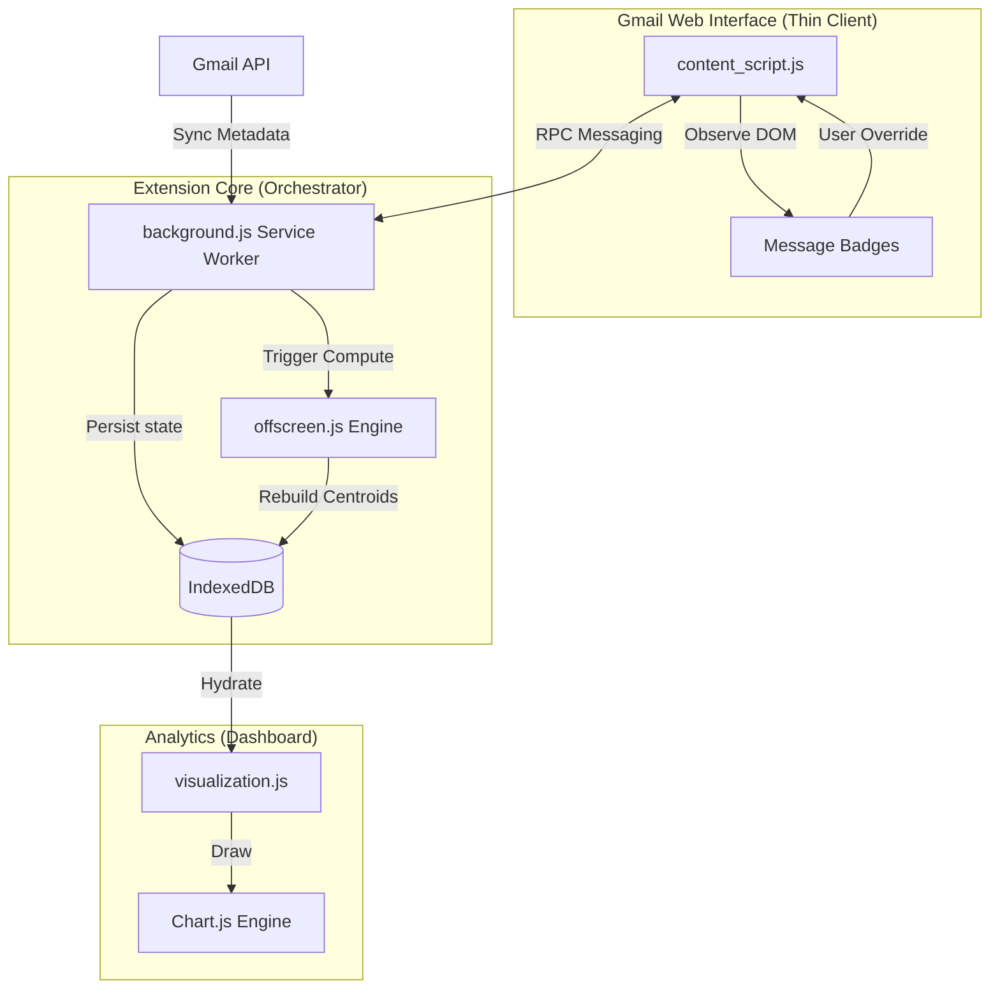

# Auto Email Labeler: System Design & Engineering

A decentralized, privacy-first intelligence layer for Gmail, leveraging client-side Machine Learning to automate inbox organization without external data leakage.

## 1. Problem Statement

Modern email management suffers from a **Trilemma of Friction**:
1.  **Cognitive Overload**: The sheer volume of incoming mail exceeds the user's capacity for manual categorization.
2.  **Privacy Erosion**: Existing "Smart Inbox" solutions rely on server-side ML, which requires granting third-party servers full access to sensitive, private communication.
3.  **Static Logic**: Standard filter rules are brittle and fail to adapt to evolving communication patterns without manual maintenance.

Current solutions either compromise on privacy (Server-Side ML) or adaptability (Manual Filters). There is a critical need for a system that provides the intelligence of modern classifiers while maintaining the security of local, client-side processing.

## 2. Proposed Application Solution

**Auto Email Labeler** is a Manifest V3-compliant Chrome Extension that implements an autonomous "Intelligence Loop" directly inside the browser. It captures email metadata via the native Gmail API, performs real-time vector-based classification on the user's machine, and overlays intuitive visual labels onto the Gmail interface.

The application achieves this through a **Distributed Browser Architecture**, offloading heavy computations to background processes while maintaining a responsive, "thin" UI layer in the Gmail tab.

---

## 3. Tech Stack

### Core Runtime
*   **Manifest V3 (MV3)**: Utilizes Service Workers and declarative permissions for enhanced security and performance.
*   **JavaScript (ES6+)**: Vanilla JS logic to minimize dependency footprint and maximize execution speed.

### Data & Persistence
*   **IndexedDB (IDB)**: A high-performance, transactional database used to store training datasets, sender memory, and clustering centroids. Unlike `storage.local`, IDB provides the structured querying and volume support necessary for large email datasets.
*   **Google OAuth2 & Gmail API**: Direct, secure integration for fetching message metadata and applying native Gmail labels.

### Processing & Machine Learning
*   **Chrome Offscreen Documents**: A dedicated document for running heavy, non-blocking computations (TF-IDF vectorization and Centroid rebuilding) that are unsuitable for the ephemeral nature of a Service Worker.
*   **Custom Vectorization Engine**: A lightweight TF-IDF (Term Frequency-Inverse Document Frequency) implementation for feature extraction.

### Visualization & UI
*   **Chart.js**: Dynamic, canvas-based rendering for the "Label Intelligence Dashboard."
*   **Vanilla CSS3 (Aesthetic Layer)**: A custom design system featuring glassmorphism, dark mode, and micro-animations for a premium dashboard experience.

---

## 4. System Architecture

The system is designed around a **Client-Server model contained entirely within the browser**.

---

## 5. Technical Rationale & Methodologies

### Why IndexedDB?
We opted for **IndexedDB** over the standard `chrome.storage` API because machine learning requires storing thousands of vectorized email samples. `chrome.storage` has restrictive size limits and lacks the transactional indexing needed to perform fast searches across 2,500+ records in real-time.

### Why Offscreen Processing?
Manifest V3 Service Workers have a short lifecycle and can be terminated at any time. Heavy ML tasks (like rebuilding a global vocabulary from thousands of emails) take longer than a Service Worker's active window. We use **Offscreen Documents** to maintain a persistent, non-blocking computational environment, ensuring the Gmail UI remains buttery smooth during training phases.

### Why Centroid-Based ML?
Unlike deep learning models (Transformers/BERT) which are computationally expensive and require heavy assets, we use a **Centroid-Based Similarity Classifier**. 
*   **Efficiency**: It performs O(k) comparisons where k is the number of labels, making it exceptionally fast for browser inference.
*   **Adaptability**: The model is "Living." As you manually label an email, the system re-averages the centroid for that label, allowing the model to adapt to your preferences instantly without a global "training" step.

### Why the "Thin Client" Content Script?
Gmail is a massive, complex Single Page Application (SPA). To prevent performance degradation, `content_script.js` performs zero logic. It simply observes the DOM, sends an RPC message to the background orchestrator, and waits for a "ready-to-render" prediction. This keeps the user's Gmail tab fast and light.

---

## 6. Implementation & Installation

1.  **Clone the Repo**: `git clone <repo-url>`
2.  **Load Unpacked**: Go to `chrome://extensions`, enable **Developer Mode**, and click **Load Unpacked**. Select the project folder.
3.  **Authorize**: Open the extension popup, enable "Background Sync API," and follow the OAuth2 prompt to grant Gmail access.
4.  **Analyze**: Open the **Label Intelligence Dashboard** via the floating "Auto Labeler" button in Gmail to see your inbox distribution in real-time.

---

## 7. Security & Privacy Assurance
*   **Local Processing**: 0% of your email data is sent to external servers. All classification happens in your browser's RAM.
*   **Scope Minimalism**: The extension requests only `gmail.readonly` and `gmail.labels` scopes, the absolute minimum required for functionality.
*   **No Dependency Leakage**: The system is built with zero third-party tracking scripts, ensuring your data remains your data.
